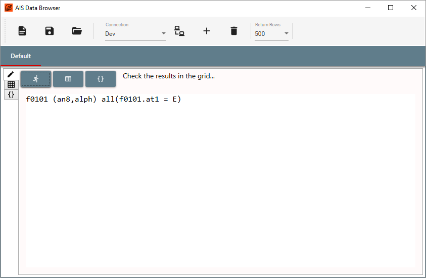
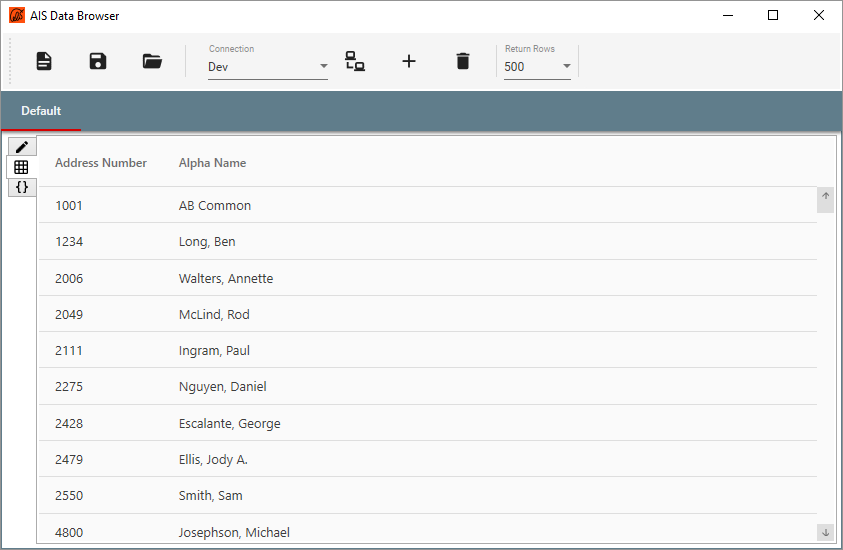
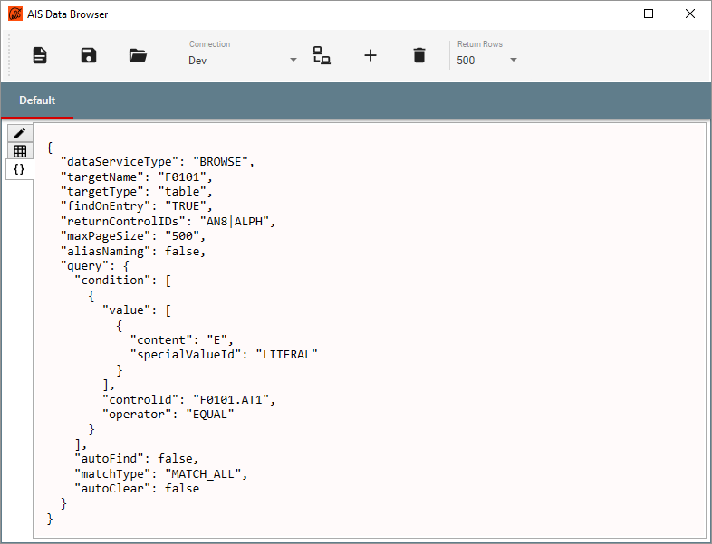
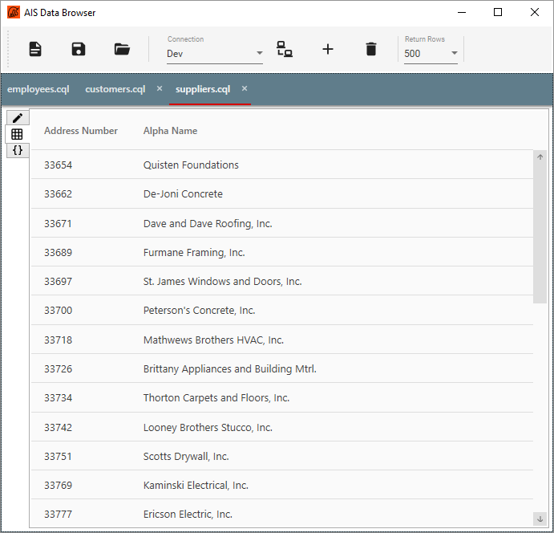
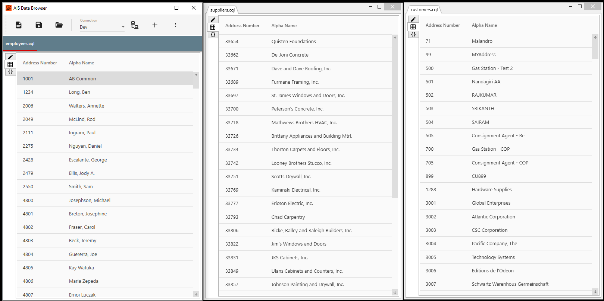

## Overview

A data browser application for Oracle E1 based on AIS.

### Requirments

Runs on Windows 7 or Server 2008 R2 SP1 or later versions.  
Requires .Net Framework 4.7 (automatically installed if not present).

Requires AIS Server Release 9.2.0.2 or higher.

### Installation

### Usage

Once connected to an AIS Server, enter a query command and submit it.

View the results are in a data grid.

View the AIS payload request.

The queries can be saved for later user.

Open muliple tabs for different queries.

Drag the tabs to separate windows for side-by-side comparison.

