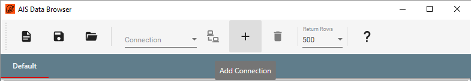
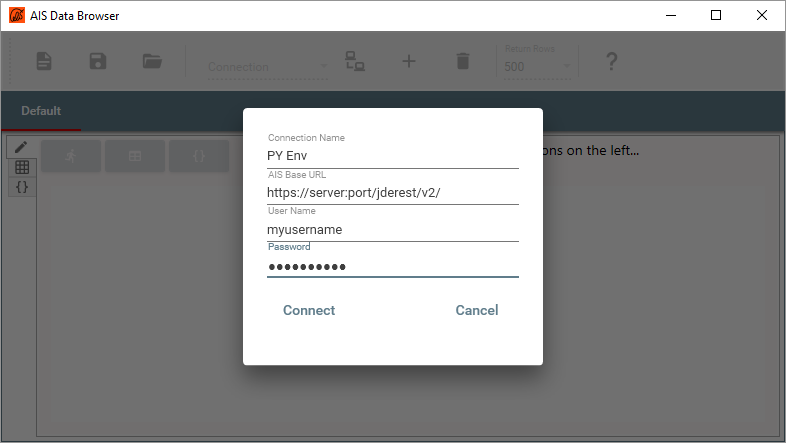
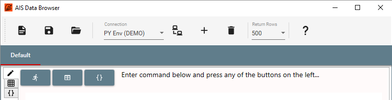
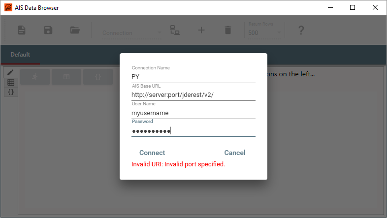

---
title: Connect to AIS
nav_order: 2
---
To connect to an AIS Server, use the `+` button in the toolbar to add a new connection.

Enter a name for the connection, the AIS Url and valid user name and press the `Connect` button.  
Note the trailing `v2/` in the example above, which stands for `Version 2` of the AIS.

A successful connection will close the connection dialog box and show the connection in the drop-down list box with the user name within brackets to indicate that the connection is active.

The `Submit` and `Get Columns` buttons will also become available once a connection is active.

To add more connections, for example to different E1 environments, use the `+` button again.  To delete a connection use the rubbish bin to the right of the `+` button and to connect to an existing connection use the `connect` button to its left.

A failed connection will display an error message on the bottom of the dialog.

There are two reasons for connection failure.

- Invalid `AIS Base Url`.  To verify the Url, copy it to a browser's address bar and append it with `defaultconfig`.  This should return the [AIS Server Capabilities](https://docs.oracle.com/cd/E53430_01/EOIIS/capblties_endpts.htm#EOIIS183) (the return is a json file which might cause the browser to prompt wheather to open it).
- Invalid user name or password.  This will typically result in a `Forbidden` error.

